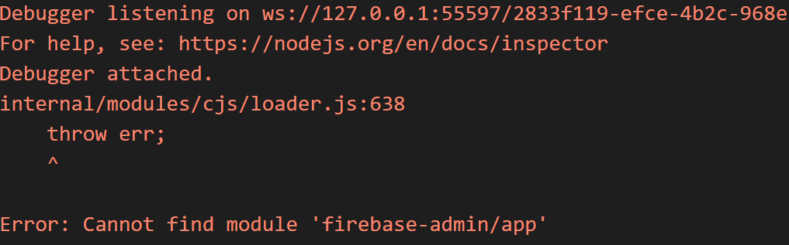
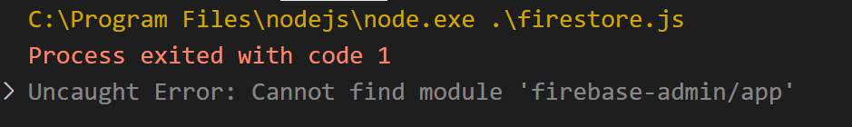

### firebase
練習Firebase

連結方式
https://hackernoon.com/nodejs-setup-firebase-in-4-step-tutorial-example-easy-beginner-service-account-key-json-node-server-d61e803d6cc8

### 看看 有沒有安裝 
```
[C:\隨意]>npm install firebase-admin --save
```
```
[C:\隨意]>npm install -g firebase-tools
```
```
[C:\隨意]>firebase -V 
```
有的話 有顯示版本

### 看看  Firebase CLI 有沒有登入
```
[C:\隨意]>firebase login
```
成功的話，會顯示登入的EMAIL

### 看看有無登入Firebase 專案
```
[C:\隨意]>firebase projects:list
```
```
┌──────────────────────┬────────────────────┬────────────────┬──────────────────────┐ 
│ Project Display Name │ Project ID         │ Project Number │ Resource Location ID │ 
├──────────────────────┼────────────────────┼────────────────┼──────────────────────┤ 
│ polor-ar             │ polor-ar (current) │ xxxxxxxxxxx    │ xxxxxxxxxx           │ 
└──────────────────────┴────────────────────┴────────────────┴──────────────────────┘ 
```

### 把 Firebase 初始化
```
[C:\隨意]>firebase init
```

### hosting(託管網站)
安裝方式:
```
firebase init hosting
```
## firebase deploy  << ↓↓↓會失敗，Package.json永遠搞不定，要改成↓↓↓↓
```
firebase deploy --only hosting
```
理論上就能通關了

### 部屬網站 測試，不是真的上傳，會給一個臨時網址
```
firebase hosting:channel:deploy polor-ar
```

### 部屬網站方式(測試完畢再上傳)
```
firebase deploy --only hosting
```


### 安裝不成功



要把node更新到最新版，很多問題就解決了

### 參考筆記:
[很詳細I](https://www.letswrite.tw/cloud-functions-init/)

(很詳細II)[https://www.letswrite.tw/gas-firestore/]
